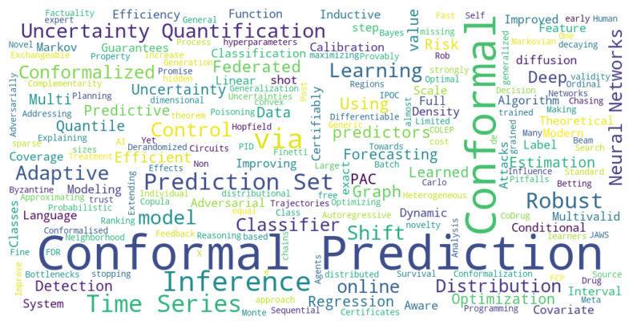
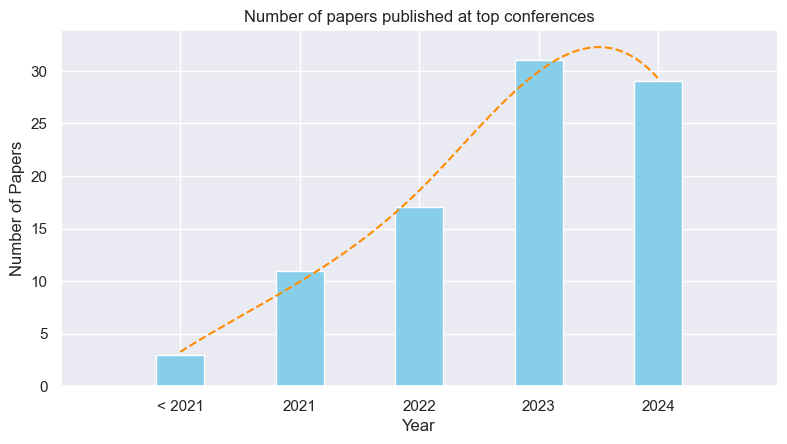

# Conformal Prediction Papers

A collection of academic papers on the subject of **conformal prediction**. 

  
  

### Timeline:
[2024](#2024) &nbsp;
[2023](#2023) &nbsp;
[2022](#2022) &nbsp;
[2021](#2021) &nbsp;
[< 2021](#before_2021) &nbsp;

---

### 2024
| Author(s)           | Title                                                                                                                                                | Venue | Code                                                                                  | 
|:--------------------|------------------------------------------------------------------------------------------------------------------------------------------------------|-------|---------------------------------------------------------------------------------------|
| Yan et al.          | [Provably Robust Conformal Prediction with Improved Efficiency](https://openreview.net/forum?id=BWAhEjXjeG)                                          | ICLR  |                                                                                       |
| Quach et al.        | [Conformal Language Modeling](https://openreview.net/forum?id=pzUhfQ74c5)                                                                            | ICLR  |                                                                                       |
| Angelopoulos et al. | [Conformal Risk Control](https://openreview.net/forum?id=33XGfHLtZg)                                                                                 | ICLR  | [[Code]](https://github.com/aangelopoulos/conformal-risk)                             |
| Sun et al.          | [Copula Conformal Prediction for Multi-step Time Series Forecasting](https://openreview.net/forum?id=jCdoLxMZxf)                                     | ICLR  | [[Code]](https://github.com/Rose-STL-Lab/CopulaCPTS)                                  |
| Farinhas et al.     | [Non-Exchangeable Conformal Risk Control](https://openreview.net/forum?id=j511LaqEeP)                                                                | ICLR  | [[Code](https://github.com/deep-spin/non-exchangeable-crc)]                           |
| Guha et al.         | [Conformal Prediction via Regression-as-Classification](https://openreview.net/forum?id=rulxyXjf46)                                                  | ICLR  |                                                                                       |
| Kang et al.         | [COLEP: Certifiably Robust Learning-Reasoning Conformal Prediction via Probabilistic Circuits](https://openreview.net/pdf?id=XN6ZPINdSg)             | ICLR  |                                                                                       |
| Zargarbashi et al.  | [Conformal Inductive Graph Neural Networks](https://openreview.net/forum?id=homn1jOKI5)                                                              | ICLR  | [[Code]](https://github.com/soroushzargar/conformal-node-classification)              |
| Mohri et al.        | [Language Models with Conformal Factuality Guarantees](https://icml.cc/virtual/2024/poster/32822)                                                    | ICML  | [[Code]](https://github.com/tatsu-lab/conformal-factual-lm)                           |
| Kang et al.         | [Rob-FCP: Certifiably Byzantine-Robust Federated Conformal Prediction](https://icml.cc/virtual/2024/poster/35015)                                    | ICML  | [[Code]](https://openreview.net/attachment?id=rFZtyj5kBz&name=supplementary_material) |
| Qi et al.           | [Conformalized Survival Distributions: A Generic Post-Process to Increase Calibration](https://icml.cc/virtual/2024/poster/33286)                    | ICML  | [[Code]](https://github.com/shi-ang/CSD)                                              |
| Angelopoulos et al. | [Online conformal prediction with decaying step sizes](https://icml.cc/virtual/2024/poster/35102)                                                    | ICML  | [[Code]](https://github.com/aangelopoulos/online-conformal-decaying)                  |
| Kiyani et al.       | [Conformal Prediction with Learned Features](https://icml.cc/virtual/2024/poster/33774)                                                              | ICML  |                                                                                       |
| Zargarbashi et al.  | [Robust Yet Efficient Conformal Prediction Sets](https://icml.cc/virtual/2024/poster/34224)                                                          | ICML  |                                                                                       |
| Li et al.           | [Data Poisoning Attacks against Conformal Prediction](https://icml.cc/virtual/2024/poster/33473)                                                     | ICML  |                                                                                       |
| Zhou et al.         | [Conformalized Adaptive Forecasting of Heterogeneous Trajectories](https://icml.cc/virtual/2024/poster/33115)                                        | ICML  | [[Code]](https://github.com/FionaZ3696/CAFHT)                                         |
| Podkopaev et al.    | [Adaptive Conformal Inference by Betting](https://icml.cc/virtual/2024/poster/33190)                                                                 | ICML  |                                                                                       |
| Liu et al.          | [Multi-Source Conformal Inference Under Distribution Shift](https://icml.cc/virtual/2024/poster/32978)                                               | ICML  | [[Code]](https://github.com/yiliu1998/Multi-Source-Conformal)                         |
| Prinster et al.     | [Conformal Prediction for AI Agents](https://icml.cc/virtual/2024/poster/34552)                                                                      | ICML  |                                                                                       |
| Zheng et al.        | [Conformal Predictions under Markovian Data](https://icml.cc/virtual/2024/poster/33483)                                                              | ICML  |                                                                                       |
| Xu et al.           | [Conformal prediction for multi-dimensional time-series](https://icml.cc/virtual/2024/poster/32830)                                                  | ICML  | [[Code]](https://github.com/hamrel-cxu/MultiDimSPCI)                                  |
| Cresswell et al.    | [Conformal Prediction Sets Improve Human Decision Making](https://icml.cc/virtual/2024/poster/35030)                                                 | ICML  | [[Code]](https://github.com/layer6ai-labs/hitl-conformal-prediction)                  |
| Liu et al.          | [The Pitfalls and Promise of Conformal Inference Under Adversarial Attacks](https://icml.cc/virtual/2024/poster/35089)                               | ICML  | [[Code]](https://github.com/ziquanliu/ICML2024-AT-UR)                                 |
| Huang et al.        | [Conformal Prediction for Deep Classifier via Label Ranking](https://icml.cc/virtual/2024/poster/33656)                                              | ICML  | [[Code]](https://openreview.net/attachment?id=zkVm3JqJzs&name=supplementary_material) |
| Ai et al.           | [Not all distributional shifts are equal: Fine-grained robust conformal inference](https://icml.cc/virtual/2024/poster/35127)                        | ICML  | [[Code]](https://github.com/zhimeir/finegrained-conformal-paper)                      |
| Deutschmann et al.  | [Conformal Autoregressive Generation: Beam Search with Coverage Guarantees](https://ojs.aaai.org/index.php/AAAI/article/view/29062)                  | AAAI  |                                                                                       |
| Qian et al.         | [Towards Modeling Uncertainties of Self-Explaining Neural Networks via Conformal Prediction](https://ojs.aaai.org/index.php/AAAI/article/view/29382) | AAAI  |                                                                                       |
| Bethell et al.      | [Robust Uncertainty Quantification Using Conformalised Monte Carlo Prediction](https://ojs.aaai.org/index.php/AAAI/article/view/30084)               | AAAI  | [[Code]](https://github.com/team-daniel/MC-CP)                                        |
| Cleaveland et al.   | [Conformal Prediction Regions for Time Series Using Linear Complementarity Programming](https://ojs.aaai.org/index.php/AAAI/article/view/30089)      | AAAI  | [[Code]](https://github.com/earnedkibbles58/timeParamCPScores)                        |

### 2023
| Author(s)           | Title                                                                                                                                                                                                  | Venue   | Code                                                                                           | 
|:--------------------|--------------------------------------------------------------------------------------------------------------------------------------------------------------------------------------------------------|---------|------------------------------------------------------------------------------------------------|
| Teng et al.         | [Predictive Inference with Feature Conformal Prediction](https://openreview.net/forum?id=0uRm1YmFTu)                                                                                                   | ICLR    | [[Code]](https://github.com/AlvinWen428/FeatureCP)                                             |
| Jung et al.         | [Batch Multivalid Conformal Prediction](https://openreview.net/forum?id=Dk7QQp8jHEo)                                                                                                                   | ICLR    | [[Code]](https://github.com/ProgBelarus/BatchMultivalidConformal)                              |
| Plassier et al.     | [Conformal Prediction for Federated Uncertainty Quantification Under Label Shift](https://proceedings.mlr.press/v202/plassier23a.html)                                                                 | ICML    |                                                                                                |
| Bhatnagar et al.    | [Improved online conformal prediction via strongly adaptive online learning](https://proceedings.mlr.press/v202/bhatnagar23a.html)                                                                     | ICML    | [[Code]](https://github.com/salesforce/online_conformal)                                       |
| Xu et al.           | [Sequential predictive conformal inference for time series](https://proceedings.mlr.press/v202/xu23r.html)                                                                                             | ICML    | [[Code]](https://github.com/hamrel-cxu/SPCI-code?tab=readme-ov-file)                           |
| Liang et al.        | [Conformal inference is (almost) free for neural networks trained with early stopping](https://proceedings.mlr.press/v202/liang23i.html)                                                               | ICML    | [[Code]](https://github.com/ZiyiLiang/Conformalized_early_stopping)                            |
| Zaffran et al.      | [Conformal prediction with missing values](https://proceedings.mlr.press/v202/zaffran23a.html)                                                                                                         | ICML    | [[Code]](https://github.com/mzaffran/ConformalPredictionMissingValues)                         |
| Prinster et al.     | [JAWS-X: Addressing Efficiency Bottlenecks of Conformal Prediction Under Standard and Feedback Covariate Shift](https://proceedings.mlr.press/v202/prinster23a.html)                                   | ICML    | [[Code]](https://github.com/drewprinster/jaws-x)                                               |
| Salinas et al.      | [Optimizing hyperparameters with conformal quantile regression](https://proceedings.mlr.press/v202/salinas23a.html)                                                                                    | ICML    | [[Code]](https://github.com/geoalgo/syne-tune/tree/icml_conformal)                             |
| Teneggi et al.      | [How to trust your diffusion model: a convex optimization approach to conformal risk control](https://proceedings.mlr.press/v202/teneggi23a.html)                                                      | ICML    | [[Code]](https://github.com/Sulam-Group/k-rcps)                                                |
| Zargarbashi et al.  | [Conformal prediction sets for graph neural networks](https://proceedings.mlr.press/v202/h-zargarbashi23a.html)                                                                                        | ICML    | [[Code]](https://github.com/soroushzargar/DAPS)                                                |
| Straitouri et al.   | [Improving expert predictions with conformal prediction](https://proceedings.mlr.press/v202/straitouri23a.html)                                                                                        | ICML    | [[Code]](https://github.com/Networks-Learning/improve-expert-predictions-conformal-prediction) |
| Nettasinghe et al.  | [Extending conformal prediction to hidden Markov models with exact validity via de Finetti's theorem for Markov chains](https://proceedings.mlr.press/v202/nettasinghe23a.html)                        | ICML    |                                                                                                |
| Lin et al.          | [Fast online value-maximizing prediction sets with conformal cost control](https://proceedings.mlr.press/v202/lin23j.html)                                                                             | ICML    | [[Code]](https://github.com/zlin7/FavMac)                                                      |
| Humbert et al.      | [One-shot federated conformal prediction](https://proceedings.mlr.press/v202/humbert23a.html)                                                                                                          | ICML    | [[Code]](https://github.com/pierreHmbt/FedCP-QQ)                                               |
| Guha et al.         | [Conformalization of sparse generalized linear models](https://proceedings.mlr.press/v202/guha23b.html)                                                                                                | ICML    | [[Code]](https://github.com/EtashGuha/sparse_conformal)                                        |
| Lu et al.           | [Federated conformal predictors for distributed uncertainty quantification](https://proceedings.mlr.press/v202/lu23i)                                                                                  | ICML    | [[Code]](https://github.com/clu5/federated-conformal)                                          |
| Auer et al.         | [Conformal Prediction for Time Series with Modern Hopfield Networks](https://proceedings.neurips.cc/paper_files/paper/2023/hash/aef75887979ae1287b5deb54a1e3cbda-Abstract-Conference.html)             | NeurIPS | [[Code]](https://github.com/ml-jku/HopCPT)                                                     |
| Dey et al.          | [Conformal Prediction Sets for Ordinal Classification](https://neurips.cc/virtual/2023/poster/71305)                                                                                                   | NeurIPS |                                                                                                |
| Laghuvarapu et al.  | [CoDrug: Conformal Drug Property Prediction with Density Estimation under Covariate Shift](https://nips.cc/virtual/2023/poster/72201)                                                                  | NeurIPS | [[Code]](https://github.com/siddharthal/CoDrug/)                                               |
| Angelopoulos et al. | [Conformal PID Control for Time Series Prediction](https://neurips.cc/virtual/2023/poster/69896)                                                                                                       | NeurIPS | [[Code]](https://github.com/aangelopoulos/conformal-time-series)                               |
| Ding et al.         | [Class-Conditional Conformal Prediction with Many Classes](https://neurips.cc/virtual/2023/poster/70548)                                                                                               | NeurIPS | [[Code]](https://github.com/tiffanyding/class-conditional-conformal)                           |
| Alaa et al.         | [Conformal Meta-learners for Predictive Inference of Individual Treatment Effects](https://nips.cc/virtual/2023/oral/73862)                                                                            | NeurIPS | [[Code]](https://github.com/AlaaLab/conformal-metalearners)                                    |
| Sun et al.          | [Conformal Prediction for Uncertainty-Aware Planning with Diffusion Dynamics Model](https://neurips.cc/virtual/2023/poster/71449)                                                                      | NeurIPS |                                                                                                |
| Huang et al.        | [Uncertainty Quantification over Graph with Conformalized Graph Neural Networks](https://proceedings.neurips.cc/paper_files/paper/2023/hash/54a1495b06c4ee2f07184afb9a37abda-Abstract-Conference.html) | NeurIPS | [[Code]](https://github.com/snap-stanford/conformalized-gnn)                                   |
| Sharma et al.       | [PAC-Bayes Generalization Certificates for Learned Inductive Conformal Prediction](https://neurips.cc/virtual/2023/poster/71506)                                                                       | NeurIPS | [[Code]](https://github.com/NVlabs/pac-bayes-conformal-prediction)                             |
| Bashari et al.      | [Derandomized novelty detection with FDR control via conformal e-values](https://papers.nips.cc/paper_files/paper/2023/hash/cec8ad7715d0d13899d5d7d31970f527-Abstract-Conference.html)                 | NeurIPS | [[Code]](https://github.com/Meshiba/derandomized-novelty-detection)                            |
| Martinez et al.     | [Approximating Full Conformal Prediction at Scale via Influence Functions](https://ojs.aaai.org/index.php/AAAI/article/view/25814)                                                                     | AAAI    | [[Code]](https://github.com/cambridge-mlg/acp)                                                 |
| Ghosh et al.        | [Improving Uncertainty Quantification of Deep Classifiers via Neighborhood Conformal Prediction: Novel Algorithm and Theoretical Analysis](https://ojs.aaai.org/index.php/AAAI/article/view/25936)     | AAAI    | [[Code]](https://github.com/medford-group/conformal_prediction_in_latent_space)                |
| Chen et al.         | [IPOC: An Adaptive Interval Prediction Model based on Online Chasing and Conformal Inference for Large-Scale Systems](https://dl.acm.org/doi/10.1145/3580305.3599396)                                  | KDD     |                                                                                                |
| Kong et al.         | [Uncertainty Quantification in Deep Learning](https://dl.acm.org/doi/abs/10.1145/3580305.3599577)                                                                                                      | KDD     |                                                                                                |

### 2022
| Author(s)        | Title                                                                                                                                                                                           | Venue   | Code                                                                         | 
|:-----------------|-------------------------------------------------------------------------------------------------------------------------------------------------------------------------------------------------|---------|------------------------------------------------------------------------------|
| Gendler et al.   | [Adversarially Robust Conformal Prediction](https://openreview.net/forum?id=9L1BsI4wP1H)                                                                                                        | ICLR    | [[Code]](https://github.com/Asafgendler/RSCP)                                |
| Stutz et al.     | [Learning Optimal Conformal Classifiers](https://openreview.net/forum?id=t8O-4LKFVx)                                                                                                            | ICLR    |                                                                              |
| Bai et al.       | [Efficient and Differentiable Conformal Prediction with General Function Classes](https://openreview.net/forum?id=Ht85_jyihxp)                                                                  | ICLR    | [[Code]](https://github.com/allenbai01/cp-gen)                               |
| Zaffran et al.   | [Adaptive Conformal Predictions for Time Series](https://proceedings.mlr.press/v162/zaffran22a.html)                                                                                            | ICML    | [[Code]](https://github.com/mzaffran/AdaptiveConformalPredictionsTimeSeries) |
| Fisch et al.     | [Conformal Prediction Sets with Limited False Positives](https://proceedings.mlr.press/v162/fisch22a.html)                                                                                      | ICML    |                                                                              |
| Ndiaye et al.    | [Stable Conformal Prediction Sets](https://proceedings.mlr.press/v162/ndiaye22a.html)                                                                                                           | ICML    | [[Code]](https://github.com/EugeneNdiaye/stable_conformal_prediction)        |
| Marx et al.      | [Modular Conformal Calibration](https://proceedings.mlr.press/v162/marx22a.html)                                                                                                                | ICML    |                                                                              |
| Einbinder et al. | [Training Uncertainty-Aware Classifiers with Conformalized Deep Learning](https://proceedings.neurips.cc/paper_files/paper/2022/hash/8c96b559340daa7bb29f56ccfbbc9c2f-Abstract-Conference.html) | NeurIPS | [[Code]](https://github.com/bat-sheva/conformal-learning)                    |
| Liu et al.       | [Conformalized Fairness via Quantile Regression](https://proceedings.neurips.cc/paper_files/paper/2022/hash/4b52b3c50110fc10f6a1a86055682ea2-Abstract-Conference.html)                          | NeurIPS | [[Code]](https://github.com/Lei-Ding07/Conformal_Quantile_Fairness)          |
| Bastani et al.   | [Practical Adversarial Multivalid Conformal Prediction](https://proceedings.neurips.cc/paper_files/paper/2022/hash/bcdaaa1aec3ae2aa39542acefdec4e4b-Abstract-Conference.html)                   | NeurIPS | [[Code]](https://github.com/ProgBelarus/MultiValidPrediction)                |
| Sesia et al.     | [Conformal Frequency Estimation with Sketched Data](https://proceedings.neurips.cc/paper_files/paper/2022/hash/2b2011a7d5396faf5899863d896a3c24-Abstract-Conference.html)                       | NeurIPS | [[Code]](https://github.com/msesia/conformalized-sketching)                  |
| Lin et al.       | [Conformal Prediction with Temporal Quantile Adjustments](https://proceedings.neurips.cc/paper_files/paper/2022/hash/c8d2860e1b51a1ffadc7ed0a06f8d8f5-Abstract-Conference.html)                 | NeurIPS | [[Code]](https://github.com/zlin7/TQA)                                       |
| Taufiq et al.    | [Conformal Off-Policy Prediction in Contextual Bandits](https://proceedings.neurips.cc/paper_files/paper/2022/hash/cc84bfabe6389d8883fc2071c848f62a-Abstract-Conference.html)                   | NeurIPS |                                                                              |
| Lu et al.        | [Fair Conformal Predictors for Applications in Medical Imaging](https://ojs.aaai.org/index.php/AAAI/article/view/21459)                                                                         | AAAI    | [[Code]](https://github.com/clu5/AAAI-22)                                    |
| Kaur et al.      | [iDECODe: In-Distribution Equivariance for Conformal Out-of-Distribution Detection](https://ojs.aaai.org/index.php/AAAI/article/view/20670)                                                     | AAAI    | [[Code]](https://github.com/ramneetk/iDECODe)                                |
| Xu et al.        | [Modern Theoretical Tools for Designing Information Retrieval System](https://dl.acm.org/doi/10.1145/3534678.3542614)                                                                           | KDD     |                                                                              |
| Li et al.        | [PAC-Wrap: Semi-Supervised PAC Anomaly Detection](https://dl.acm.org/doi/10.1145/3534678.3539408)                                                                                               | KDD     |                                                                              |

### 2021
| Author(s)            | Title                                                                                                                                                                             | Venue   | Code                                                                | 
|:---------------------|-----------------------------------------------------------------------------------------------------------------------------------------------------------------------------------|---------|---------------------------------------------------------------------|
| Angelopoulos et al.  | [Uncertainty Sets for Image Classifiers using Conformal Prediction](https://openreview.net/forum?id=eNdiU_DbM9)                                                                   | ICLR    | [[Code]](https://github.com/aangelopoulos/conformal_classification) |
| Fisch et al.         | [Efficient Conformal Prediction via Cascaded Inference with Expanded Admission](https://openreview.net/forum?id=tnSo6VRLmT)                                                       | ICLR    | [[Code]](https://github.com/ajfisch/conformal-cascades)             |
| Xu et al.            | [Conformal Prediction Interval for Dynamic Time-Series](https://proceedings.mlr.press/v139/xu21h.html)                                                                            | ICML    | [[Code]](https://github.com/hamrel-cxu/EnbPI)                       |
| Teng et al.          | [T-SCI: A Two-Stage Conformal Inference Algorithm with Guaranteed Coverage for Cox-MLP](https://proceedings.mlr.press/v139/teng21a.html)                                          | ICML    |                                                                     |
| Fisch et al.         | [Few-Shot Conformal Prediction with Auxiliary Tasks](https://proceedings.mlr.press/v139/fisch21a.html)                                                                            | ICML    | [[Code]](https://github.com/ajfisch/few-shot-cp)                    |
| Cherubin et al.      | [Exact Optimization of Conformal Predictors via Incremental and Decremental Learning](https://proceedings.mlr.press/v139/cherubin21a.html)                                        | ICML    | [[Code]](https://github.com/gchers/exact-cp-optimization)           |
| Stankeviciute et al. | [Conformal Time-series Forecasting](https://proceedings.neurips.cc/paper/2021/hash/312f1ba2a72318edaaa995a67835fad5-Abstract.html)                                                | NeurIPS | [[Code]](https://github.com/kamilest/conformal-rnn)                 |
| Fong et al.          | [Conformal Bayesian Computation](https://proceedings.neurips.cc/paper/2021/hash/97785e0500ad16c18574c64189ccf4b4-Abstract.html)                                                   | NeurIPS | [[Code]](https://github.com/edfong/conformal_bayes)                 |
| Gibbs et al.         | [Adaptive Conformal Inference Under Distribution Shift](https://proceedings.neurips.cc/paper/2021/hash/0d441de75945e5acbc865406fc9a2559-Abstract.html)                            | NeurIPS |                                                                     |
| Sesia et al.         | [Conformal Prediction using Conditional Histograms](https://proceedings.neurips.cc/paper/2021/hash/31b3b31a1c2f8a370206f111127c0dbd-Abstract.html)                                | NeurIPS | [[Code]](https://github.com/msesia/chr)                             |
| Ross et al.          | [Tractable Density Estimation on Learned Manifolds with Conformal Embedding Flows](https://proceedings.neurips.cc/paper/2021/hash/dfd786998e082758be12670d856df755-Abstract.html) | NeurIPS | [[Code]](https://github.com/layer6ai-labs/CEF)                      |

### Before 2021

 

| Author(s)      | Title                                                                                                                                                             | Venue    | Code | 
|:---------------|-------------------------------------------------------------------------------------------------------------------------------------------------------------------|----------|------|
| Franca et al.  | [Conformal Symplectic and Relativistic Optimization](https://proceedings.neurips.cc/paper/2020/hash/c4b108f53550f1d5967305a9a8140ddd-Abstract.html)               | NeurIPS 2020  |      |
| Ndiaye et al.       | [Computing full conformal prediction set with approximate homotopy](https://proceedings.neurips.cc/paper/2019/hash/9e3cfc48eccf81a0d57663e129aef3cb-Abstract.html) | NeurIPS 2019 |  [[Code]](https://github.com/EugeneNdiaye/homotopy_conformal_prediction) ||
| Vovk V. | [Cross-conformal predictors](https://link.springer.com/article/10.1007/s10472-013-9368-4) | Annals of Mathematics and Artificial Intelligence 2015 |  ||
---

